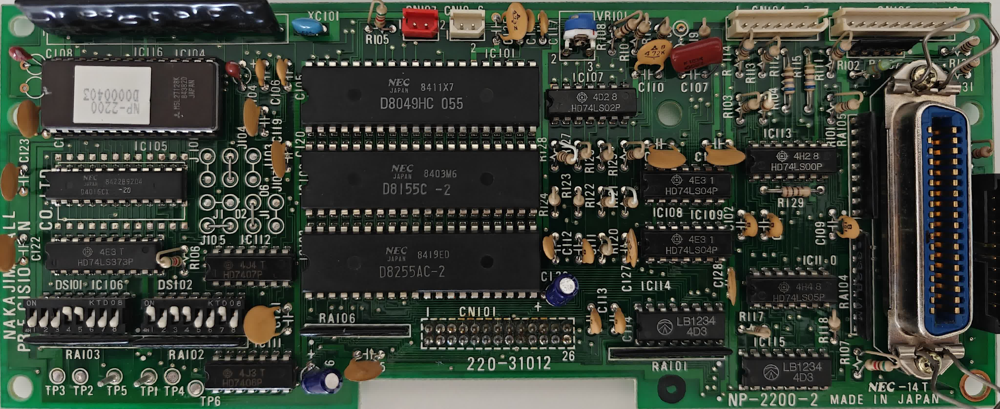
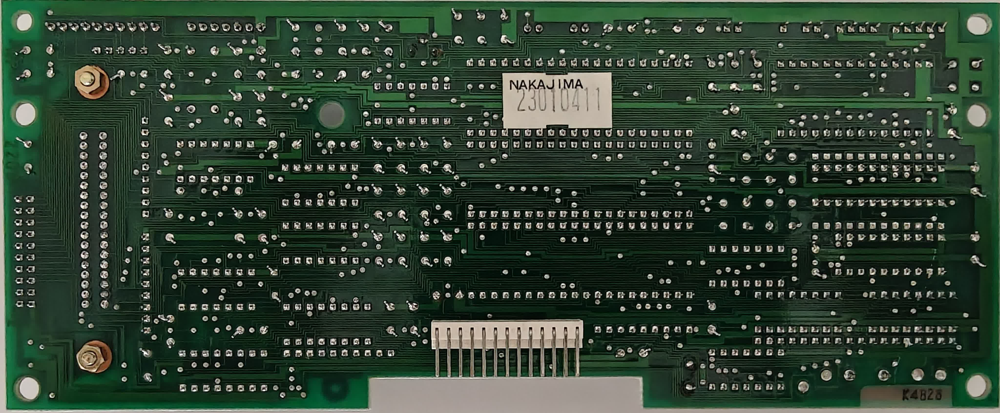

# Nakajima NP-2200 Pictures

This page contains photographs of the Nakajima NP-2200 9-pin matrix printer and its components.

## Main Board - Top Side

### Primary View

*Top side of the NP-2200-2 main board showing component layout, ICs, connectors, and identification markings.*

### Alternative View

*Alternative angle of the main board top side for component identification.*

## Main Board - Bottom Side

*Bottom side of the NP-2200-2 main board showing solder traces, component mounting, and PCB construction.*

## Printer Unit

*Pictures of the complete printer unit will be added later.*