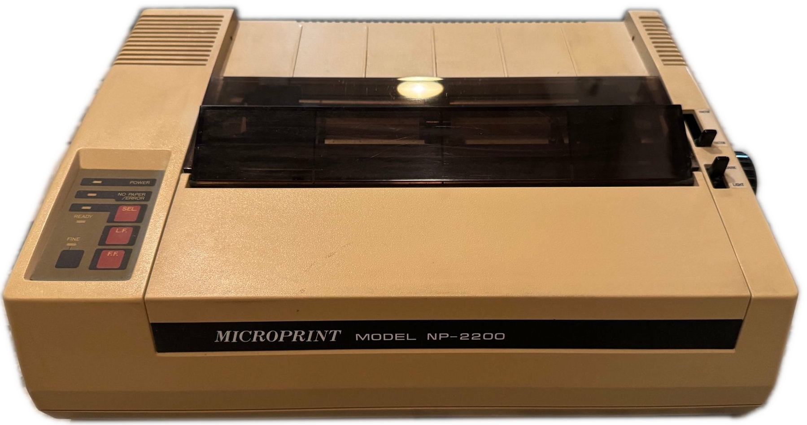

# Microprint Model NP-2200 9 pin matrix printer

The Microprint Model NP-2200 is a 9-pin dot matrix printer from the mid-1980s, representing the era when impact printers dominated computer peripherals. Built by Nakajima Precision Co., Ltd. (a company known for precision mechanical devices), this printer exemplifies the embedded system design philosophy of the early microcomputer age—using dedicated microcontrollers with minimal external components to achieve specific functionality.

---

For detailed photographs of the PCB and components, see **[pictures](PICTURES.md)**.

## NP-2200-2 Board — Summary

### Identification / markings

- Board ID: **NP-2200-2**
- PCB code: **220-31012**
- Text: **NEC-14T**, **MADE IN JAPAN**
- Manufacturer on silkscreen: **NAKAJIMA PRECISION CO., LTD**
- EPROM label: **NP-2200 D0000403**

### Architecture overview

- Core: **NEC D8049** MCU with companion **D8155** (RAM + I/O + timer) and **D8255** (PPI).
- Program/storage: **MBM27128K** (27128 EPROM, 16 KB) + **NEC D4016CX-20** SRAM (2 KB × 8).
- Glue logic: Hitachi **74LS** family (LS04, LS05, LS02, LS373, LS00) and open-collector **7406/7407**.
- Drivers: Two **Sanyo LB1234** driver/pre-driver ICs.
- Custom module: **IC116 NH-2200B** potted hybrid (board-specific interface/driver).
- Clocking: X101 crystal/resonator present (freq not printed in photos).

### Connectors (top-level)

- Two 36-pin micro-ribbon (Centronics-style) external connectors (left and right edges).
- Internal headers: **CN101** 26-pin 2×13, **CN103** shrouded IDC 20 pin 2×10
- Small harness headers: **CN104** 1×7, **CN105** 1×10, **CN106** 1×2 (white), **CN107** 1×2 (red).

### Configuration / service

- DIP switches: **DS101**, **DS102** (8-position each).
- Jumpers: **J101–J105** (solder-select pads).
- Test points: **TP1–TP6**.
- Trimmer: **VR/TVR** single-turn potentiometer.

### ICs

| RefDes | Exact top marking | Manufacturer | Part / Type | Function | Package | Notes |
|---|---|---|---|---|---|---|
| IC101 | D8049HC 055 | NEC | 8049 MCU (MCS-48) | Main controller | DIP-40 | — |
| IC102 | D8155C-2 | NEC | 8155 | RAM + I/O + timer | DIP-40 | — |
| IC103 | D8255AC-2 | NEC | 8255 PPI | Programmable peripheral interface | DIP-40 | — |
| IC104 | MBM27128K (sticker: "NP-2200 D0000403") | Fujitsu | 27128 EPROM | Char rom ([ROM dump](rom/NP-2200_D0000403.bin)) | DIP-28 (socket) | VER 4.03-U '84 B   Dip Sw  |
| IC105 | D4016CX-20 | NEC | 4016 SRAM | 2 KB × 8 static RAM | DIP-24 | — |
| IC106 | HD74LS373P | Hitachi | 74LS373 | Octal transparent latch | DIP-20 | — |
| IC107 | HD74LS02P | Hitachi | 74LS02 | Quad 2-input NOR | DIP-14 | — |
| IC108 | HD74LS04P | Hitachi | 74LS04 | Hex inverter | DIP-14 | — |
| IC109 | HD74LS04P | Hitachi | 74LS04 | Hex inverter | DIP-14 | — |
| IC110 | HD74LS05P | Hitachi | 74LS05 | Hex inverter, open-collector | DIP-14 | — |
| IC111 | HD7406P (4J3T) | Hitachi | 7406 | Hex inverter, open-collector | DIP-14 | — |
| IC112 | HD7407P (4J4T) | Hitachi | 7407 | Hex buffer, open-collector | DIP-14 | — |
| IC113 | HD74LS05P | Hitachi | 74LS05 | Hex inverter, open-collector | DIP-14 | — |
| IC114 | LB1234 (4D3) | Sanyo | LB1234 | Driver / power pre-driver | DIP-16 | — |
| IC115 | LB1234 (4D3) | Sanyo | LB1234 | Driver / power pre-driver | DIP-16 | — |
| IC116 | NH-2200B (LGIH) | Nakajima hybrid | Potted hybrid module | Board-specific interface/driver | SIP/DIP-style module | Exact function unknown from markings |

### Connectors

| RefDes | Connector type / style | Pins / rows  | Notes |
|---|---|---|---|
| CN101 | Dual-row pin header | 26 (2×13) | Power / Print head |
| CN102 | Centronics | 36 | Parallel port |
| CN103 | IDC box header (shrouded), dual-row | 20 (2×10) | Interface port ([see pinout](#cn103-pinout-20-pin-idc-box-header)) |
| CN104 | JST-style vertical friction-lock header (white) | 7 | Motor control? |
| CN105 | JST-style vertical friction-lock header (white) | 10 | Control pannel? |
| CN106 | Mini JST-style vertical header (white) | 2 | Cover closed switch |
| CN107 | Mini JST-style vertical header (red) | 2  | Paper inserted switch |

---

### CN103 Pinout (20-pin IDC Box Header)

*Layout is not confirmed*
| Signal | I/O | Pin | Pin | I/O | Signal |
|---|---|---|---|---|---|
| /STROBE | IN | 1 ● | ● 2 | IN | D0 |
| D1 | IN | 3 ● | ● 4 | IN | D2 |
| D3 | IN | 5 ● | ● 6 | IN | D4 |
| D5 | IN | 7 ● | ● 8 | IN | D6 |
| D7 | IN | 9 ● | ● 10 | OUT | /ACK |
| BUSY | OUT | 11 ● | ● 12 | OUT | PE (Paper Empty) |
| SELECT (on  line) | OUT | 13 ● | ● 14 | OUT | /ERROR (Fault) |
| /RESET | IN | 15 ● | ● 16 | ? |  ? |
| +5V | PWR | 17 ● | ● 18 | PWR | GND |
| +12V ? | PWR ? | 19 ● | ● 20 | PWR | GND |

/AUTOFEED ?
---

## Board Specifications

### Physical Characteristics
- **PCB Dimensions**: *[To be measured]*
- **Component Height**: *[To be measured]*
- **Mounting**: *[Standard mounting holes/brackets - TBD]*

### Power Requirements
- **Supply Voltage**: +5V DC *(typical for TTL/CMOS logic of this era)*
- **Current Draw**: *[To be measured]*
- **Power Connectors**: Via CN101 26-pin header

---

## References

### Datasheets and Technical Documentation
- **NEC D8049** - MCS-48 Family User's Manual
- **NEC D8155** - RAM-I/O-Timer Datasheet  
- **NEC D8255** - Programmable Peripheral Interface Datasheet
- **Fujitsu MBM27128K** - 128K EPROM Datasheet
- **Sanyo LB1234** - Driver IC Datasheet *(if available)*

### Service Information
- **Service Manual**: *[Not currently available]*
- **Parts Lists**: *[Not currently available]*
- **Schematic Diagrams**: *[Not currently available - reverse engineering needed]*

### Related Documentation
- **Centronics Parallel Interface Standard** - IEEE 1284 predecessor
- **MCS-48 Application Notes** - Intel/NEC development guides
